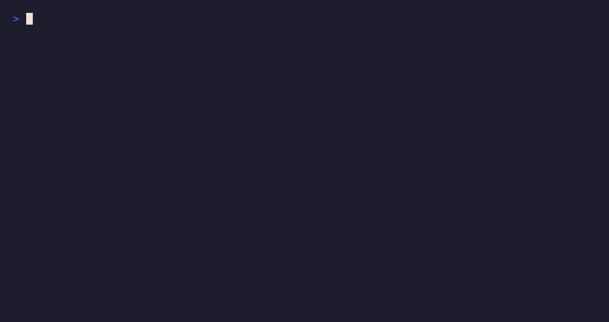

# mcp-grafana

[](https://www.npmjs.com/package/@dockndevai/mcp-grafana)
[](https://github.com/dockndevai/mcp-grafana/actions/workflows/ci.yml)
[](LICENSE)

A **safe-by-default** [Model Context Protocol](https://modelcontextprotocol.io) server for **Grafana**. It lets an agent explore and operate Grafana — search dashboards, read the dashboard JSON model, list and **query datasources** (Prometheus / Loki / SQL), inspect alert rules and annotations, and (in higher modes) create/update dashboards and folders, write annotations, and delete.

Part of the [dockndevai MCP server suite](https://dockndevai.github.io/) — one governance model across all of them.



## What it gives an agent

The server starts **read-only** (see [Safe by default](#safe-by-default)); higher-capability tools are only registered when you raise the mode.

| Tool | For | Needs mode |
|---|---|---|
| `get_health` | check the instance is up, version | read-only |
| `search` | find dashboards & folders by name/tag (get UIDs) | read-only |
| `list_dashboards` / `list_folders` | enumerate dashboards / folders | read-only |
| `get_dashboard` | the full dashboard JSON model + meta | read-only |
| `list_datasources` / `get_datasource` | datasources (secrets redacted) | read-only |
| `query_datasource` | run PromQL / LogQL / SQL via the unified query API | read-only |
| `list_alert_rules` | Grafana-managed alert rules | read-only |
| `list_annotations` | events overlaid on graphs | read-only |
| `create_or_update_dashboard` | upsert a dashboard (versioned, reversible) | read-write |
| `create_folder` | create a folder | read-write |
| `create_annotation` | mark a deploy/incident on graphs | read-write |
| `delete_dashboard` / `delete_folder` / `delete_annotation` | delete (irreversible) | admin + `GRAFANA_ALLOW_DELETE` |

## Install

```bash
npx -y @dockndevai/mcp-grafana
```

You need a Grafana **service account token** (Administration → Service accounts → *Add service account* → *Add token*). Give it the **least role** that works — **Viewer** for read-only use, **Editor** to create/update, **Admin** only if you must delete.

## Configure

```json
{
  "mcpServers": {
    "grafana": {
      "command": "npx",
      "args": ["-y", "@dockndevai/mcp-grafana"],
      "env": {
        "GRAFANA_URL": "http://localhost:3000",
        "GRAFANA_TOKEN": "glsa_...",
        "GRAFANA_MODE": "read-only"
      }
    }
  }
}
```

See [docs/CLIENTS.md](docs/CLIENTS.md) for Claude Code / Cursor / Codex / VS Code / Windsurf snippets, and [.env.example](.env.example) for every supported variable.

## Safe by default

The access model is enforced by [`src/security.ts`](src/security.ts) — defence in depth on top of the service-account token's own role:

- **`GRAFANA_MODE`** — `read-only` (default) → `read-write` → `admin`. A tool is registered only if the mode allows its capability. Read-only exposes the 11 read tools; edits need `read-write`; deletes need `admin`.
- **`GRAFANA_ALLOW_DELETE`** — deletes are irreversible, so on top of `admin` mode they also require this flag.
- **`GRAFANA_FOLDER_ALLOWLIST` / `GRAFANA_PROTECTED_FOLDERS`** — confine which folders can be written to; mark folders (e.g. `production`) that may be read but never modified or deleted.
- **`GRAFANA_DATASOURCE_ALLOWLIST`** — restrict which datasources `query_datasource` may hit.
- **`GRAFANA_DRY_RUN`** — validate and log writes without executing them.
- **`GRAFANA_AUDIT_LOG`** — a JSON audit line per guarded operation, on stderr (default on).
- **Interactive confirmation** — when the client supports MCP elicitation, deleting a dashboard/folder/annotation prompts the **human** to approve before it runs; clients that can't elicit fall back to the `GRAFANA_ALLOW_DELETE` gate.
- **Secrets are never returned** — datasource `secureJsonData`, passwords and tokens are stripped from every response.

See [SECURITY.md](SECURITY.md).

## Working with dashboards & queries

Conventions for the dashboard JSON model, panel/target shapes, PromQL/LogQL/SQL query patterns, folder organisation and safe editing live in the bundled skill: [`.claude/skills/grafana-dashboards-and-queries/SKILL.md`](.claude/skills/grafana-dashboards-and-queries/SKILL.md). Agents that load it can build and edit dashboards to a consistent standard without being re-taught each time.

## Developing

```bash
npm install
npm run build
GRAFANA_URL=http://localhost:3000 GRAFANA_TOKEN=glsa_… node dist/index.js
# introspect without a live Grafana:
echo '{"jsonrpc":"2.0","id":1,"method":"tools/list","params":{}}' | GRAFANA_TOKEN=x node dist/index.js
```

## Licence

MIT
